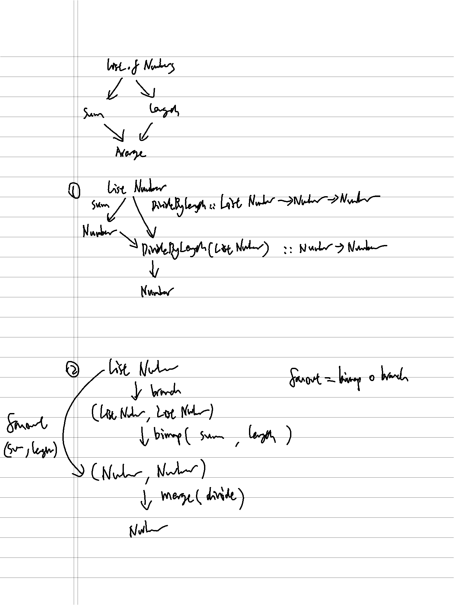

1. imperative way: intermediate results held by explicit variables
2. imperative with built-in reduce
3. partially point-free: curry and partial application, dependency graph with depth 4, one explicit variable
4. fully point-free: Pair ADT, branch/fanout -> merge, dependency graph with depth 4, branching logic captured by Pair
5. fully point-free: Ramda converge, "infinite" numbers of branching by providing a list of functions on the same type

